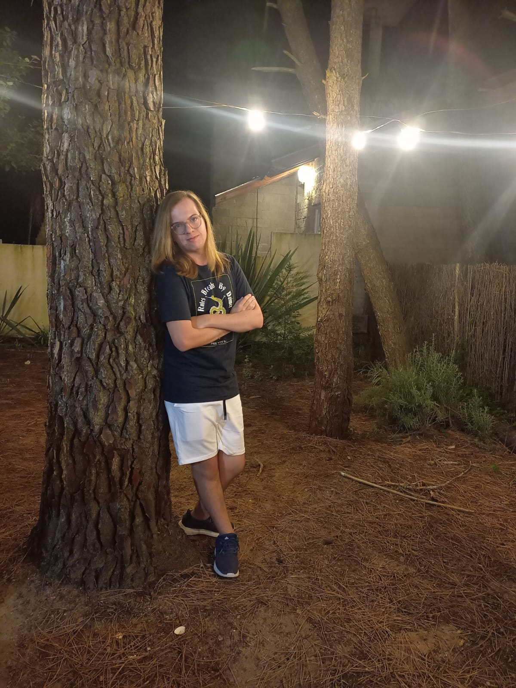

## Hola!

Mi nombre es Valentin Fondovila, tengo 19 años, mi legajo es 222-311-9 y soy de la division K2104

Estoy muy emocionado por esta clase, no solo me gusta mucho la programacion, pero parece que esta clase me ayudara entender mejor java y otros lenguajes, el profe y los ayudantes fueron muy buena onda tambien, asi que creo que la pasare muy bien aca
Cuando no estoy estudiando o haciendo tarea me gusta jugar, normalmente juegos de detective, o completar juegos al 100%. Es mi hobby y me divierte mucho

Espero pasarlo muy bien en esta clase
